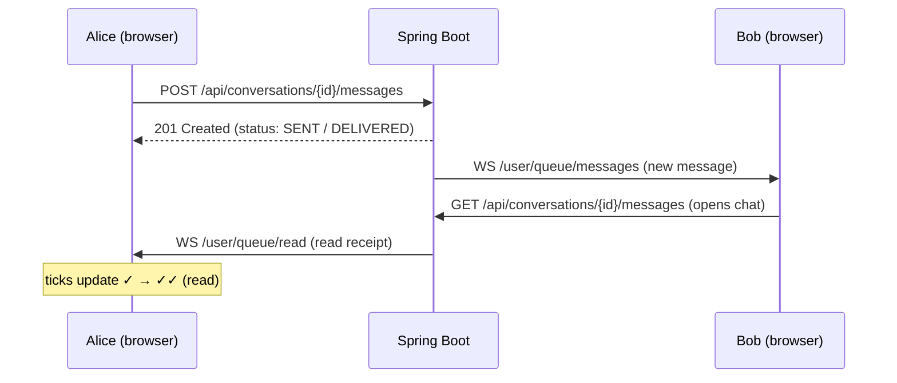

# SitApp

A WhatsApp-inspired messenger built with **Angular** and **Spring Boot**.

Users can register, sign in, manage their profile, search for other users, and
have private one-to-one conversations with **real-time** message delivery and
WhatsApp-style delivery ticks. New registrations are moderated by an
administrator before an account becomes active.

## Features

- ✔ User registration
- ✔ Login / Logout (stateless JWT)
- ✔ User approval by an administrator (approve / reject)
- ✔ User search
- ✔ Private one-to-one conversations
- ✔ Sending & receiving text messages in real time (WebSocket / STOMP)
- ✔ Delivery status — Sent → Delivered → Read (✓ / ✓✓)
- ✔ Conversation list sorted by the last message
- ✔ Unread message counters
- ✔ Profile editing (first name, last name, phone, email, photo)
- ✔ Password changing

## Getting Started

### Prerequisites

- **Java 17+**
- **Node.js 20+** and **npm**
- *(optional)* **PostgreSQL 14+** — only needed to run against a real database;
  the app uses an embedded H2 database by default.

### 1. Backend — Spring Boot API (port `8080`)

```bash
cd backend
./mvnw spring-boot:run
```

On Windows use `mvnw.cmd spring-boot:run`. The Maven Wrapper downloads Maven
automatically, so no global Maven installation is required.

By default the backend runs on an embedded **H2** database (a file under
`backend/data/`) — nothing to install. On first start a default administrator
account is seeded:

| Username | Password   |
| -------- | ---------- |
| `admin`  | `admin123` |

To run against **PostgreSQL** instead, create a database named `sitapp` and
start with the `postgres` profile:

```bash
./mvnw spring-boot:run -Dspring-boot.run.profiles=postgres
```

Credentials can be supplied via the `DB_USER` / `DB_PASSWORD` environment
variables (defaults: `sitapp` / `sitapp`).

### 2. Frontend — Angular app (port `4200`)

```bash
cd frontend
npm install
npm start
```

Then open **http://localhost:4200**.

### Try it out

1. Sign in as `admin` / `admin123`.
2. Register a new user from the **Create account** page — it starts as *pending*.
3. Back as the admin, open **Admin** and approve the registration.
4. Sign in as the approved user, search for someone, and start chatting.

## Tech Stack

**Frontend**
- Angular 22 (standalone components, signals, zoneless change detection)
- TypeScript
- [`@stomp/stompjs`](https://stomp-js.github.io/) — WebSocket / STOMP client
- SCSS

**Backend**
- Java 17
- Spring Boot 4
- Spring Security + JSON Web Tokens ([jjwt](https://github.com/jwtk/jjwt))
- Spring Data JPA (Hibernate)
- Spring WebSocket with STOMP
- Bean Validation, Lombok
- Maven (Wrapper)

**Database**
- PostgreSQL (production profile)
- H2 (embedded, for local development)

## Architecture

The project is a small monorepo: a stateless REST + WebSocket backend and a
single-page Angular frontend that talks to it.

```
Messenger/
├── backend/                     # Spring Boot REST API + WebSocket
│   └── src/main/java/com/sitapp/
│       ├── domain/              # JPA entities & enums (User, Conversation, Message …)
│       ├── repository/          # Spring Data JPA repositories
│       ├── service/             # Business logic (Auth, Admin, Profile, Chat, Message, Presence)
│       ├── web/                 # REST controllers + DTOs + error handling
│       ├── security/            # JWT service, auth filter, STOMP auth interceptor
│       └── config/              # Security, WebSocket, JPA & data-seeding configuration
│
└── frontend/                    # Angular single-page application
    └── src/app/
        ├── core/                # Models, services, HTTP interceptor, route guards
        ├── shared/              # Reusable UI (avatar)
        └── features/            # Feature screens
            ├── auth/            #   login / register
            ├── shell/           #   authenticated layout + WebSocket lifecycle
            ├── chats/           #   conversation list, chat view, user search
            ├── profile/         #   profile & password
            └── admin/           #   registration moderation
```

### Authentication & moderation

- Authentication is **stateless**: the backend issues a **JWT** on login, and
  the Angular HTTP interceptor attaches it as a `Bearer` token to every request.
- New accounts are created with status **PENDING** and cannot log in until an
  administrator sets them to **APPROVED** (or **REJECTED**). Roles are `USER`
  and `ADMIN`; admin-only endpoints are guarded on both the server and the client.

### Real-time messaging

Messages are sent over REST and pushed to the recipient over **STOMP-over-WebSocket**.
The JWT is carried in the STOMP `CONNECT` frame and validated by a channel
interceptor, so socket sessions are authenticated just like REST calls.



Delivery status transitions **SENT → DELIVERED → READ**:

- **SENT** — stored on the server (recipient offline).
- **DELIVERED** — the recipient has an active WebSocket session; a presence
  tracker also upgrades pending messages the moment a user comes online.
- **READ** — the recipient opened the conversation; a read receipt is pushed
  back to the sender so their ticks update live.

### Main API endpoints

| Method & path | Purpose |
| --- | --- |
| `POST /api/auth/register` | Create a pending account |
| `POST /api/auth/login` | Authenticate, receive a JWT |
| `POST /api/auth/logout` · `GET /api/auth/me` | Log out · current user |
| `GET /api/admin/users/pending` | List registrations awaiting approval *(admin)* |
| `POST /api/admin/users/{id}/approve` · `.../reject` | Moderate a registration *(admin)* |
| `GET /api/profile` · `PUT /api/profile` | View · update own profile |
| `PUT /api/profile/password` | Change password |
| `GET /api/users/search?q=` | Search approved users |
| `GET /api/conversations` | List conversations (unread + last message) |
| `POST /api/conversations/with/{userId}` | Open or create a conversation |
| `GET` · `POST /api/conversations/{id}/messages` | History · send a message |
| `WS /ws` | STOMP endpoint (`/user/queue/messages` · `/read` · `/delivered`) |

## Design

Clean, minimal UI in a **white + soft pink + deep teal** palette.

---

## Acknowledgements

Built by **Jana Kim** · 2026.

Developed in collaboration with **Claude** (Anthropic's Claude Code), which
assisted with implementation, code review and testing throughout the project.
